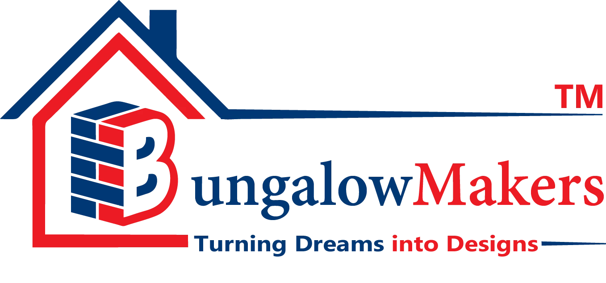

# Bungalow Makers - House Design Company Website

A modern, responsive website for a house design and architectural company. This project showcases various house designs, elevations, and plans with interactive features including dark mode, cost calculators, and image galleries.

## 🏠 Live Demo

[View Live Demo](#) (Add your GitHub Pages link here once deployed)

## ✨ Features

- **Responsive Design** - Fully responsive layout that works on all devices
- **Dark Mode** - Toggle between light and dark themes with preference saved to localStorage
- **Interactive Sidebar Dashboard** - Quick access to user profile, notifications, and settings
- **Image Carousel** - Auto-playing slideshow with manual controls and dot indicators
- **Multiple Galleries** - Showcase house designs by area, elevation styles, and plans
- **Interactive Calculators**
  - Home Construction Cost Calculator (with state/city dropdowns)
  - EMI Loan Calculator with sliders
- **Contact Form** - With Google Maps integration
- **Smooth Animations** - Hover effects, transitions, and scroll animations

## 🛠️ Technologies Used

- HTML5
- CSS3 (Custom properties, Flexbox, Grid)
- JavaScript (ES6+)
- Font Awesome 6.5.0
- Google Fonts

## 📁 Project Structure
